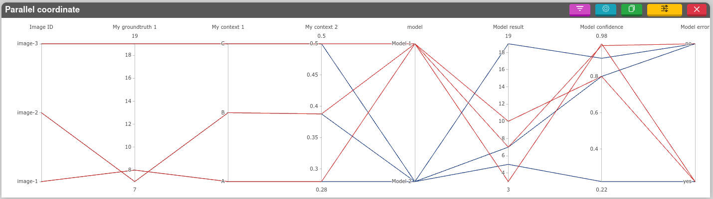

# DebiAI Python module
[](https://opensource.org/licenses/Apache-2.0)
[](https://badge.fury.io/py/debiai)


The DebiAI Python module is an interface with [DebiAI](https://debiai.irt-systemx.fr), you can use directly it in your Python project workflow to provide DebiAI with data.

## Documentation
[DebiAI Python module](https://debiai.irt-systemx.fr/dataInsertion/pythonModule)

## Features :
- Basic:
  - Project creation
  - Project data insertion
  - Model metadata and model results insertion
- Advanced:
  - Selection made with the dashboard samples recovery
  - tf.dataset creation from the project selections (beta)

## Requierements:
* [A running DebiAI instance](https://debiai.irt-systemx.fr/debiai/gettingStarted/installation/)
* Numpy
* Pandas
* Eventualy Tensorflow

## Installation

```bash
pip install --upgrade debiai
```
## Quick start

```python
from debiai import debiai
import pandas as pd
import numpy as np

DEBIAI_BACKEND_URL = "http://localhost:3000/"
DEBIAI_PROJECT_NAME = "Hello DebiAI"

# Initialisation
my_debiai = debiai.Debiai(DEBIAI_BACKEND_URL)

# Creating a project
debiai_project = my_debiai.create_project(DEBIAI_PROJECT_NAME)

# Creating the project block structure
block_structure = [
    {
        # The sample: an image with contexts, GDT and an ID
        "name": "Image ID",
        "contexts": [
            {"name": "My context 1",     "type": "text"},
            {"name": "My context 2",     "type": "number"}
        ],
        "groundTruth": [
            {"name": "My groundtruth 1", "type": "number"}
        ]
    }
]

debiai_project.set_blockstructure(block_structure)


# ======== Adding the project samples ========
# Adding samples with a dataframe
samples_df = pd.DataFrame({
    "Image ID":         ["image-1", "image-2", "image-3"],
    "My context 1":     ["A", "B", "C"],
    "My context 2":     [0.28, 0.388, 0.5],
    "My groundtruth 1": [8, 7, 19],
})

debiai_project.add_samples_pd(samples_df)

# The project samples are ready to be analysed with the dashboard


# ===== Adding the project model results =====
# Setting the project models expected results
expected_results = [
    {"name": "Model result",     "type": "number"},
    {"name": "Model confidence", "type": "number"},
    {"name": "Model error",      "type": "text"},
]

debiai_project.set_expected_results(expected_results)

# Create the models
debiai_model_1 = debiai_project.create_model("Model 1")
debiai_model_2 = debiai_project.create_model("Model 2")

# Adding results with a numpy Array
results_np = np.array(
    [["Image ID", "Model result", "Model confidence", "Model error"],
     ["image-1", 3,  0.98, "yes"],
     ["image-2", 7,  0.97, "no"],
     ["image-3", 10, 0.8, "yes"]]
)

debiai_model_1.add_results_np(results_np)

# Adding results with a dataframe
results_df = pd.DataFrame({
    "Image ID": ["image-1", "image-2", "image-3"],
    "Model result": [5, 7, 19],
    "Model confidence": [0.22, 0.8, 0.9],
    "Model error": ["yes", "no", "no"],
})

debiai_model_2.add_results_df(results_df)

# The model results are ready to be analysed with the Debiai dashboard
```


## Limitations
- Nan or empty values are not supported at the moment.
- `/`, `.`, `:`, `?`, `*`, `\`, and `|`, are not supported in the project name and in the data/blocks ids.

> :warning: **If the data don't upload or don't load**: check that there is only string, number or boolean values (no Nan, objects or array values) in the data that you are uploading, and that there is no special character in the project name and the data ids.

---

<p align="center" style="display:flex; align-items:center; justify-content:space-around" >
  Developed by :
  <a href="https://www.irt-systemx.fr/" title="IRT SystemX">
   
  </a>
  Integrated in :
  <a href="https://www.confiance.ai/" title="Conf AI">
   
  </a>
</p>

---
